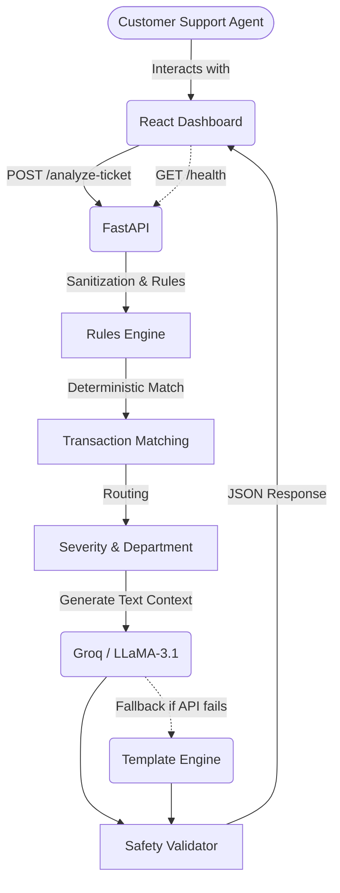

# QueueStorm Investigator: Full Architecture Workflow

This document provides a detailed overview of the architecture, data flow, and components of the **QueueStorm Investigator**, an AI-powered support ticket investigator for digital finance.

---

## 1. High-Level Architecture

The system is built as a full-stack application composed of a **React Frontend** and a **FastAPI Backend**, working together to provide an interactive dashboard for investigating support tickets.

---

## 2. Component Details

### 2.1. Frontend (React + Vite)
The frontend serves as the interactive dashboard for support agents to submit tickets, view real-time health, manage transaction history, and visualize the analysis results.

- **Stack:** React 18, Vite, CSS Modules.
- **Key Components:**
  - `HealthStatus`: Polls `GET /health` every 30s to monitor backend uptime.
  - `TicketForm`: Allows submission of ticket constraints (ID, text, language, channel, user type). Also allows loading of sample data for testing.
  - `ResultDisplay`: Visualizes structured metrics, agent summaries, recommended actions, confidence scores, and safety reason codes.
- **API Proxy:** Configured via Vite proxy to route `/api` to the backend.

### 2.2. Backend (FastAPI)
The backend provides a high-performance REST API for processing tickets via a rules-first hybrid AI pipeline.

- **Stack:** Python 3.10+, FastAPI, Uvicorn, Pydantic (data validation).
- **Core Endpoints:**
  - `GET /health`: Fast uptime check.
  - `POST /analyze-ticket`: Main investigation pipeline that takes a `TicketRequest` and returns a `TicketResponse`.

---

## 3. The Investigation Pipeline (Detailed Workflow)

The core logic resides in `app/investigator.py`, functioning as a 9-step pipeline. The architecture is a **Rules-First Hybrid** — deterministic processes handle critical decisions, and the LLM focuses entirely on natural language generation.

### Step 1: Input Validation
- FastAPI and Pydantic validate the incoming `TicketRequest` schema.
- Non-empty complaint enforcement. Invalid enums for optional fields gracefully default to `None`.

### Step 2: Sanitization (Prompt Injection Defense)
- **Component:** `app/safety.py`
- Adversarial instructions (e.g., "ignore all previous instructions") are neutralized to prevent prompt injection.

### Step 3: Rule-Based Classification
- **Component:** `app/rules.py`
- Complaint text is analyzed using keyword heuristics to determine the `CaseType` (e.g., `wrong_transfer`, `payment_failed`, `phishing_or_social_engineering`).

### Step 4: Transaction Matching & Scoring
- **Component:** `app/investigator.py`
- Signals are extracted from the complaint text:
  - Amount (`5000 tk`) - 40 pts
  - Type (`sent`, `cash out`) - 25 pts
  - Time (`today`, `yesterday`) - 20 pts
  - Counterparty (`+88017...`) - 15 pts
- Each provided transaction in the history is scored against these signals.
- **Evidence Verdict:** Evaluates the highest-scoring transaction.
  - Returns `consistent` if the transaction aligns with the complaint logic (e.g., a pending status for an agent cash-in issue).
  - Returns `inconsistent` if patterns indicate false claims.
  - Returns `insufficient_data` if no transaction matches confidently.

### Step 5: Routing (Severity & Department)
- Using the `CaseType` and `EvidenceVerdict`, the system assigns:
  - **Severity:** `low`, `medium`, `high`, `critical`. (e.g., Phishing is critical).
  - **Department:** `general_support`, `fraud_ops`, `financial_ops`, etc.
  - **Human Review:** Flagged if evidence is inconsistent or transactions involve high amounts.

### Step 6: Text Generation (LLM / Rules Hybrid)
- **Component:** `app/llm.py` & `app/rules.py`
- A context object is built and sent to the LLM (Llama 3.1 via Groq API) to generate three human-readable fields:
  1. `agent_summary`
  2. `recommended_next_action`
  3. `customer_reply`
- **Fallback Mechanism:** If the LLM API times out, fails, or is unconfigured, rule-based text templates take over, guaranteeing 100% uptime.

### Step 7: Safety Validation
- **Component:** `app/safety.py`
- Four layers of defense enforce strict safety:
  1. System prompt constraints ("never ask for PIN").
  2. Pre-sanitization of input.
  3. **Regex Validator:** Post-checks the `customer_reply` and `recommended_next_action` for forbidden patterns (credentials request, promising refunds, third-party redirects).
  4. Hardcoded safe fallbacks if the validation fails.

### Step 8: Confidence & Reason Codes
- The system calculates a confidence score based on the clarity of the evidence (boosted if a transaction directly supports the claim).
- Reason codes (e.g., `transaction_match`, `evidence_consistent`, `critical_escalation`) are generated to explain the verdict to the agent.

### Step 9: Response Assembly
- The final `TicketResponse` object is built and serialized to JSON, instantly updating the frontend dashboard.

---

## 4. Deployment Workflow

The application can be deployed using Docker.

- **Containerization:** `Dockerfile` in the root builds the FastAPI backend. `frontend/Dockerfile` builds the React SPA using a multi-stage Nginx build.
- **Orchestration:** `docker-compose.fullstack.yml` manages both the backend (`:8000`) and the frontend (`:3000`) containers simultaneously.
- **Production Mode:** The frontend is built and served via Nginx for high-performance static file serving, while the backend utilizes Uvicorn for asynchronous request handling.
